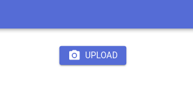
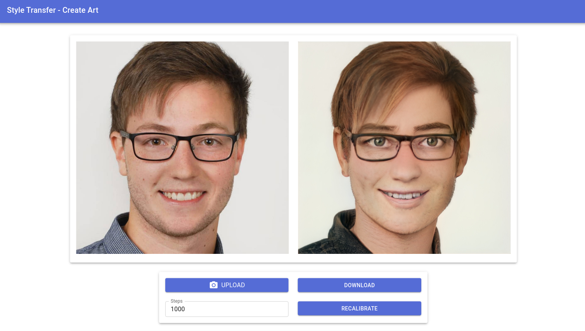
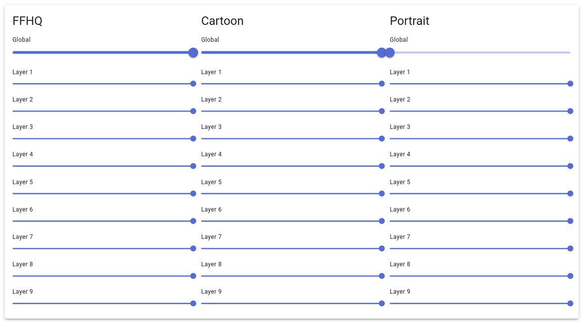

# Style Transfer: Create Art

Image editing is a challenging task because a sequence of manual steps is involved. However,
in the last decade synthetic generation of images has improved. In particular StyleGANs
can generate photorealistic images of a specific domain. By interpolating StyleGANs from
different domains allows us to create high-quality synthetic imaged from arbitrary domains.
This repository contains an application that enables real-time manipulation
of a face by interpolating the weights of multiple StyleGANs on a layer basis.

## Usage

First use the upload button to send the target image to the backend.



The application will automatically detect faces and extract them into the needed format.
The uploaded image is displayed on the left side as comparison. The result of the projection and style mix is displayed in the right image. Additionally, if you want to upload a new image, download the HD (1024x1024 pixel) result image or create a new projection with arbitrary amount of iterations you can do so with the buttons below the visualization as displayed in following figure:



The application performs a linear combination of the weight of multiple StyleGANs. You can alter the weights for the linear combination by changing the sliders at the bottom of the webapplication. To change all weights at once, use the global slider. If you want to change the weights of individual layers you can do so by changing the layer sliders.



## Installation and Setup

### Backend

Use:
```
cd backend
conda env create -f environment.yml
conda activate stylegan2
```
to install the dependencies.

Use

```
python -m art.main
```
to start the flask backend.

### Frontend

The frontend was tested using the node 16.
The node version manager (nvm) is an easy way to setup node and switch between versions easly.

Use:
```
wget -qO- https://raw.githubusercontent.com/nvm-sh/nvm/v0.39.1/install.sh | bash
```

to setup nvm and 

```
nvm install 16
nvm use 16
```
to install and use the right version.

Use
```
cd frontend
npm install
npm run build
npm start
```
to build and start the frontend.


## Training

This repository is based on NVlabs [stylegan2-ada-pytorch](https://github.com/NVlabs/stylegan2-ada-pytorch).
In order to train new models for style transfer

 - download their repository,
 - install the dependency by installing their docker or use setup a conda environment with backend/environment.yml in this repository,
 - follow the steps listed in [Preparing datasets](https://github.com/NVlabs/stylegan2-ada-pytorch),
 - and finally follow the steps in [Training new networks](https://github.com/NVlabs/stylegan2-ada-pytorch) with `--resume=ffhq1024` to use transfer learning.

Make sure to use the same base model for transfer learning that you use within the application to obtain good results.


